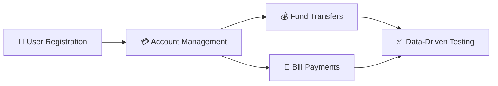

<div align="center">

# 🏦 Banking Regression Framework

### *Enterprise-Grade Selenium Test Automation for Banking Applications*

[](https://www.oracle.com/java/)
[](https://www.selenium.dev/)
[](https://testng.org/)
[](https://maven.apache.org/)

[](https://github.com/moqaddasQA/banking-regression-framework)
[](https://github.com/moqaddasQA/banking-regression-framework)
[](LICENSE)

---

### 🎯 **Production-Ready** • 🚀 **Fast Execution** • 📊 **Comprehensive Reporting** • 🐳 **Docker Ready**

</div>

---

## 🌟 Project Highlights

<table>
<tr>
<td width="50%">

### 🎯 What This Framework Does
Automates **critical banking workflows** for the ParaBank demo application, demonstrating enterprise-grade test automation practices with **Page Object Model**, **data-driven testing**, and **CI/CD integration**.

</td>
<td width="50%">

### 📈 Key Achievements
- ✅ **100% Pass Rate** - All tests passing
- ⚡ **~1 Min** - Full regression execution
- 🎨 **6 Page Objects** - Clean architecture
- 📝 **4 Test Suites** - Complete coverage

</td>
</tr>
</table>

---

## ✨ Test Coverage



| Test Scenario | Status | Description |
|--------------|--------|-------------|
| 🔐 **User Registration** | ✅ Passing | Timestamped user creation with validation |
| 💰 **Fund Transfers** | ✅ Passing | Dynamic account handling with auto-creation |
| 📄 **Bill Payments** | ✅ Passing | CSV data-driven with 2 iterations |
| 🔍 **Login Smoke Test** | ✅ Passing | Fast authentication validation (~7.7s) |

---

## 🎨 Framework Architecture

<div align="center">

### **Three-Layer Architecture Pattern**

</div>

```
╔═══════════════════════════════════════════════════════════════════╗
║                        🎯 TEST LAYER                              ║
║                                                                   ║
║    LoginTest  │  RegisterTest  │  TransferTest  │  BillPayTest    ║
╚═══════════════════════════════════════════════════════════════════╝
                                ↓
╔═══════════════════════════════════════════════════════════════════╗
║                    📄 PAGE OBJECT LAYER                           ║
║                                                                   ║
║   LoginPage  │  RegisterPage  │  AccountPage  │  TransferPage     ║
╚═══════════════════════════════════════════════════════════════════╝
                                ↓
╔═══════════════════════════════════════════════════════════════════╗
║                    🛠️ UTILITIES LAYER                             ║
║                                                                   ║
║  DriverFactory │ ConfigManager │ DataProvider │ ReportingUtils    ║
╚═══════════════════════════════════════════════════════════════════╝
```

<table>
<tr>
<td width="33%" align="center">

**🎯 Test Layer**
<br/>
Test classes with
<br/>
business logic

</td>
<td width="33%" align="center">

**📄 Page Objects**
<br/>
UI element
<br/>
interactions

</td>
<td width="33%" align="center">

**🛠️ Utilities**
<br/>
Shared helper
<br/>
functions

</td>
</tr>
</table>

</div>

---

## 🛠️ Tech Stack

<div align="center">

| Technology | Version | Purpose |
|:----------:|:-------:|:-------:|
|  <br/> **Java** | 21 | Core Language |
|  <br/> **Selenium** | 4.25.0 | Browser Automation |
|  <br/> **TestNG** | 7.10.2 | Test Framework |
|  <br/> **Maven** | 3.x | Build Tool |
|  <br/> **ExtentReports** | 5.1.1 | HTML Reports |
|  <br/> **Allure** | 2.26.0 | Test Reporting |
|  <br/> **Docker** | Latest | Containerization |
|  <br/> **Jenkins** | Latest | CI/CD Pipeline |

</div>

---

## 🚀 Quick Start

### 📋 Prerequisites

<table>
<tr>
<td>

**Required**
- ☕ Java 21+ ([Download](https://www.oracle.com/java/technologies/downloads/#java21))
- 📦 Maven 3.x ([Download](https://maven.apache.org/download.cgi))
- 🔧 Git ([Download](https://git-scm.com/downloads))

</td>
<td>

**Optional**
- 🐳 Docker (for Selenium Grid)
- 🔨 Jenkins (for CI/CD)
- 📊 Allure CLI (for reports)

</td>
</tr>
</table>

### ⚡ Installation

```bash
# 1️⃣ Clone the repository
git clone https://github.com/moqaddasQA/banking-regression-framework.git
cd banking-regression-framework

# 2️⃣ Verify Java installation
java -version
# Expected: java version "21.x.x"

# 3️⃣ Install dependencies
mvn clean install -DskipTests
```

<div align="center">

### 🎬 **You're Ready to Run Tests!**

</div>

---

## 🎯 Running Tests

<table>
<tr>
<td width="50%">

### 🔥 Quick Commands

```bash
# Run all tests
mvn clean test

# Smoke tests only
mvn clean test -Dsurefire.suiteXmlFiles=\
  src/test/resources/testng-smoke.xml

# Full regression suite
mvn clean test -Dsurefire.suiteXmlFiles=\
  src/test/resources/testng-regression.xml

# Specific test class
mvn clean test -Dtest=TransferFundsTest
```

</td>
<td width="50%">

### ⚙️ Configuration Options

```properties
# Edit: src/test/resources/framework.properties

# Browser Settings
browser.type=chrome
browser.headless=false  # Set true for CI/CD

# Application
app.url=https://parabank.parasoft.com/

# Credentials
user.name=Moqaddas
user.password=123456

# Timeouts (seconds)
implicit.wait=10
explicit.wait=15
```

</td>
</tr>
</table>

---

## 📊 Test Reports & Results

<div align="center">

### 🏆 Latest Test Run Results

| Metric | Value | Status |
|:------:|:-----:|:------:|
| **Tests Run** | 3 | ✅ |
| **Passed** | 3 | 💚 |
| **Failed** | 0 | ✅ |
| **Execution Time** | 51.79s | ⚡ |
| **Pass Rate** | 100% | 🎯 |

</div>

### 📈 Report Types

<table>
<tr>
<td width="33%" align="center">

**📄 ExtentReports**
<br/>
Interactive HTML Dashboard
<br/>
`test-output/ExtentReport.html`

</td>
<td width="33%" align="center">

**🎨 Allure Reports**
<br/>
Beautiful Test Analytics
<br/>
`mvn allure:serve`

</td>
<td width="33%" align="center">

**📋 TestNG Reports**
<br/>
Standard XML Reports
<br/>
`test-output/index.html`

</td>
</tr>
</table>

### 📸 Sample Test Output

```diff
+ ✓ TransferFundsTest.transferSmoke - PASSED (19.2s)
  User: Moqaddas1204220435
  Accounts: 25998 → 26109
  Amount: $100.00
  
+ ✓ BillPayTest.billPay[Utility Co] - PASSED (16.4s)
  User: Moq1204220459495
  Payee: Utility Co, $89.65
  
+ ✓ BillPayTest.billPay[Auto Loan] - PASSED (16.2s)
  User: Moq1204220513851
  Payee: Auto Loan, $220.00

🎉 BUILD SUCCESS - All Tests Passed!
```

---

## 🐳 Docker Support

<div align="center">

### Run Tests in Selenium Grid

</div>

```bash
# Start Selenium Grid
docker-compose up -d

# Verify Grid is running
curl http://localhost:4444/status

# Run tests against Grid
mvn clean test -Dselenium.grid.url=http://localhost:4444

# View Grid console
open http://localhost:4444

# Stop Grid
docker-compose down
```

## Project Structure

---

## 🏗️ Framework Features

<div align="center">

| Feature | Description | Benefit |
|:-------:|:------------|:--------|
| 🎨 **Page Object Model** | Separation of test logic from UI | Maintainable & reusable code |
| 📊 **Data-Driven Testing** | CSV-based test data injection | Scalable test scenarios |
| 🔄 **Dynamic Account Handling** | Runtime account creation & extraction | No manual setup required |
| ⏰ **Timestamped Users** | Millisecond-precision usernames | Zero conflicts guaranteed |
| 📈 **Dual Reporting** | ExtentReports + Allure | Beautiful insights |
| 🐳 **Docker Ready** | Selenium Grid support | Cloud-ready execution |
| 🤖 **Auto Driver Management** | WebDriverManager integration | No manual downloads |
| ⚡ **Parallel Execution** | TestNG parallel support | Faster feedback |

</div>

---

## 📁 Project Structure

```
banking-regression-framework/
│
├── 📂 src/
│   ├── 📂 main/java/com/moqaddas/banking/
│   │   ├── 📄 pages/              # 🎨 Page Objects
│   │   │   ├── BasePage.java
│   │   │   ├── LoginPage.java
│   │   │   ├── RegisterPage.java
│   │   │   ├── 📂 dashboard/
│   │   │   │   └── AccountOverviewPage.java
│   │   │   ├── 📂 transfer/
│   │   │   │   └── TransferFundsPage.java
│   │   │   └── 📂 billpay/
│   │   │       └── BillPayPage.java
│   │   │
│   │   ├── 📄 support/            # 🛠️ Utilities
│   │   │   ├── DriverFactory.java
│   │   │   ├── DriverManager.java
│   │   │   └── ConfigManager.java
│   │   │
│   │   ├── 📄 data/               # 📊 Data Providers
│   │   │   └── CsvDataProvider.java
│   │   │
│   │   └── 📄 reporting/          # 📈 Reports
│   │       ├── ExtentManager.java
│   │       └── ScreenshotUtil.java
│   │
│   └── 📂 test/
│       ├── 📂 java/com/moqaddas/banking/tests/
│       │   ├── BaseTest.java       # 🏗️ Base test class
│       │   ├── LoginSmokeTest.java
│       │   ├── RegisterUserTest.java
│       │   ├── TransferFundsTest.java
│       │   └── BillPayTest.java
│       │
│       └── 📂 resources/
│           ├── testng-smoke.xml    # 🔥 Smoke suite
│           ├── testng-regression.xml # 🎯 Regression suite
│           ├── framework.properties
│           └── 📂 data/
│               ├── billpay.csv
│               └── transfers.csv
│
├── 🐳 docker-compose.yml          # Selenium Grid
├── 🔨 Jenkinsfile                 # CI/CD pipeline
├── 📦 pom.xml                     # Maven config
└── 📖 README.md                   # You are here!
```

---

## 🎓 Key Learnings & Best Practices

<table>
<tr>
<td>

### 💡 What Makes This Framework Special

1. **🔐 Smart User Management**
   - Timestamped credentials prevent conflicts
   - Works in parallel and sequential execution

2. **🎯 Dynamic Test Data**
   - Runtime account ID extraction
   - Auto-creates missing test prerequisites

3. **📸 Comprehensive Evidence**
   - Screenshots on failure
   - Detailed HTML reports
   - Execution timeline tracking

4. **🔄 Self-Healing Tests**
   - Handles missing accounts gracefully
   - Detects and logs validation errors
   - Configurable wait strategies

</td>
<td>

### 🚀 Production-Ready Patterns

```java
// ✅ Fluent Page Object Pattern
new LoginPage(driver)
    .loginAs("user", "pass")
    .goToTransfers()
    .enterAmount("100.00")
    .submitTransfer();

// ✅ Dynamic Account Handling
String accountId = account.getFirstAccountId();
if (account.getSecondAccountId() == null) {
    account.openNewAccount();
}

// ✅ Timestamped Users
String user = "Moq" + 
    new SimpleDateFormat("MMddHHmmssSSS")
    .format(new Date());
```

</td>
</tr>
</table>

---

## 📚 Documentation

- 📖 [Full Documentation](#) *(Coming Soon)*
- 🎥 [Video Demo](#) *(Coming Soon)*
- 📝 [API Reference](#) *(Coming Soon)*
- 🔧 [Troubleshooting Guide](#) *(Coming Soon)*

---

## 🤝 Contributing

Contributions are welcome! Please feel free to submit a Pull Request.

1. Fork the repository
2. Create your feature branch (`git checkout -b feature/AmazingFeature`)
3. Commit your changes (`git commit -m 'Add some AmazingFeature'`)
4. Push to the branch (`git push origin feature/AmazingFeature`)
5. Open a Pull Request

---

## 👤 Author

<div align="center">

**Moqaddas Rahim**

SDET | QA Automation Engineer

[](https://github.com/moqaddasQA)
[](https://www.linkedin.com/in/moqaddas-rauf)
[](mailto:moqaddasr@gmail.com)

</div>


---

<div align="center">

## ⭐ Show Your Support

If you find this project helpful, please consider giving it a ⭐!

---

## 📜 License

This project is licensed under the **MIT License** - see the [LICENSE](LICENSE) file for details.

---

## 🙏 Acknowledgments

<table>
<tr>
<td align="center" width="33%">

**🎯 Test Application**
<br/>
[ParaBank](https://parabank.parasoft.com/)
<br/>
*by Parasoft*

</td>
<td align="center" width="33%">

**🤝 Community**
<br/>
Selenium WebDriver
<br/>
TestNG Contributors

</td>
<td align="center" width="33%">

**💡 Inspiration**
<br/>
Open Source QA
<br/>
Best Practices

</td>
</tr>
</table>

---

### 🚀 Built with passion for quality automation

**Made with ❤️ by [Moqaddas Rahim](https://github.com/moqaddasQA)**

<sub>Last Updated: December 2025</sub>

</div>
